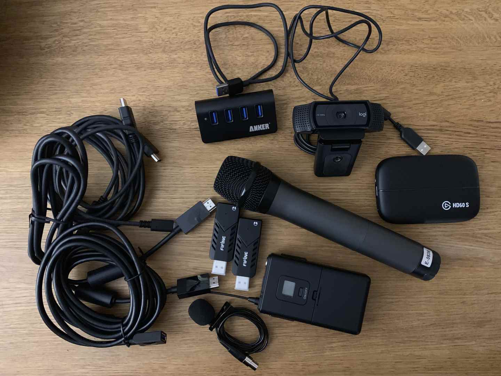

Title: "Mics, Camera, Action!"
Published: 2019-05-03
Tags:
- ADNUG
- Twitch
- YouTube
Image: 'images/BoxOfTricks.jpg'
---

At the end of last year we ran a successful [funding campaign](https://www.gofundme.com/aberdeen-developers-net-user-group) at Aberdeen Developers .NET User Group to purchase some gear to allow us to record some of our sessions. We had a good idea of what we were wanting to achieve, essentially, we wanted to be able to publish recordings of our sessions and we weren’t wanting to spend hours processing the content after the recording. With a couple of events successfully in the bag I thought it might be worth sharing our setup, so here it is...

<!--more-->

Most of the magic is done using [Open Broadcaster Software (OBS)](https://obsproject.com/), a free and open-source streaming and recording program, but before we dive into our config let’s run down our hardware.
- Microphones, probably one of the most important things for me, personally I can’t follow any video with poor sound. We have a [wireless lapel mic](https://www.amazon.co.uk/gp/product/B07F3KLX14) for the speaker and a [wireless handheld mic](https://www.amazon.co.uk/gp/product/B07F3V3LD2) for the host
- [Elgato Game Capture HD60 S](https://www.amazon.co.uk/gp/product/B01DRWCOGA), this is an awesome bit of kit, it allows us to capture the output from the presenter's laptop without having to install anything on their laptop, we also have an HDMI splitter just in case any DRM protection interferes with the process, but we've not encountered this
- [Logitech C920 HD Pro Webcam](https://www.amazon.co.uk/gp/product/B006A2Q81M) mounted on a tripod just to make things a little more interesting to watch
- [Elgato Stream Deck](https://www.amazon.co.uk/gp/product/B06W2KLM3S) to make scene selection nice and simple
- A good selection of cables, USB, HDMI and power cables as well as a USB hub to keep thing tidy

As mentioned above OBS provides much of the magic, each of the input sources above can be toggled in OBS. We have 3 different scenes; presentation, web cam directed at the speaker, and a composite of the two, which we can cycle through depending on how the presentation is going, we can also toggle each of the microphones as required. OBS can record and stream via two separate controls within the application, we have OBS setup to stream to [Twitch](https://www.twitch.tv/adnug) and record to disc, thankfully both have worked well on the night. Once recorded we only have to put the recording though ffmpeg trimming as required before uploading to our [YouTube channel](https://www.youtube.com/channel/UCRnxcmrSrc4TWKqakE4EViw).

We'll hopefully get a few more sessions recorded so make sure subscribe to [YouTube channel](https://www.youtube.com/channel/UCRnxcmrSrc4TWKqakE4EViw) so you don't miss out. If you are interested in setting something similar up and have questions please reach out if I can be of any help.
